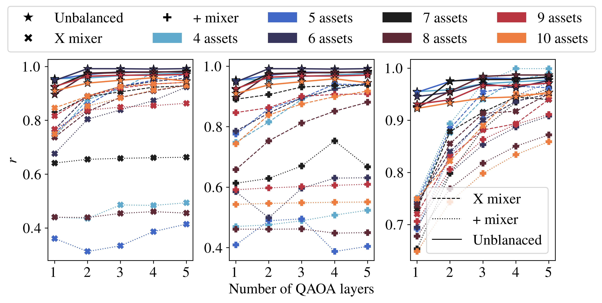
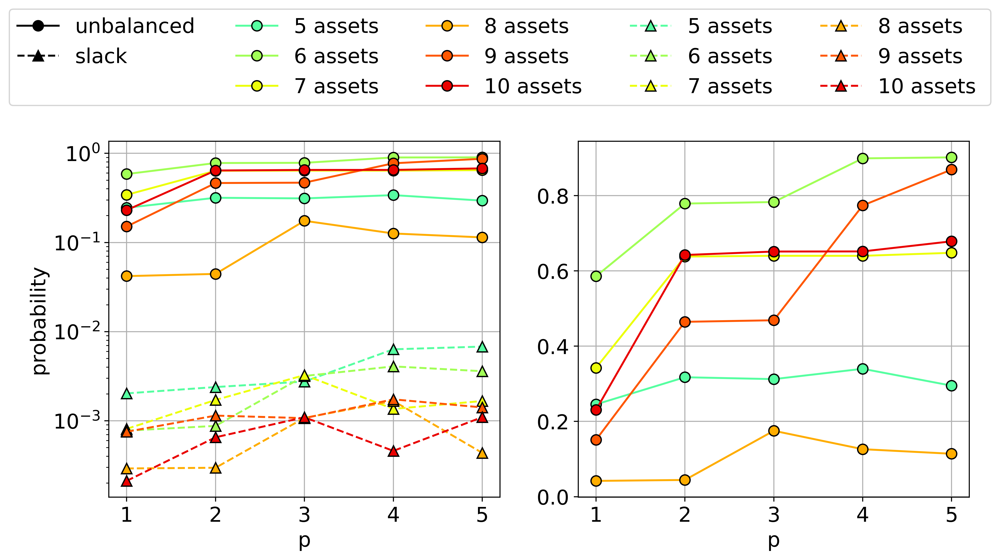
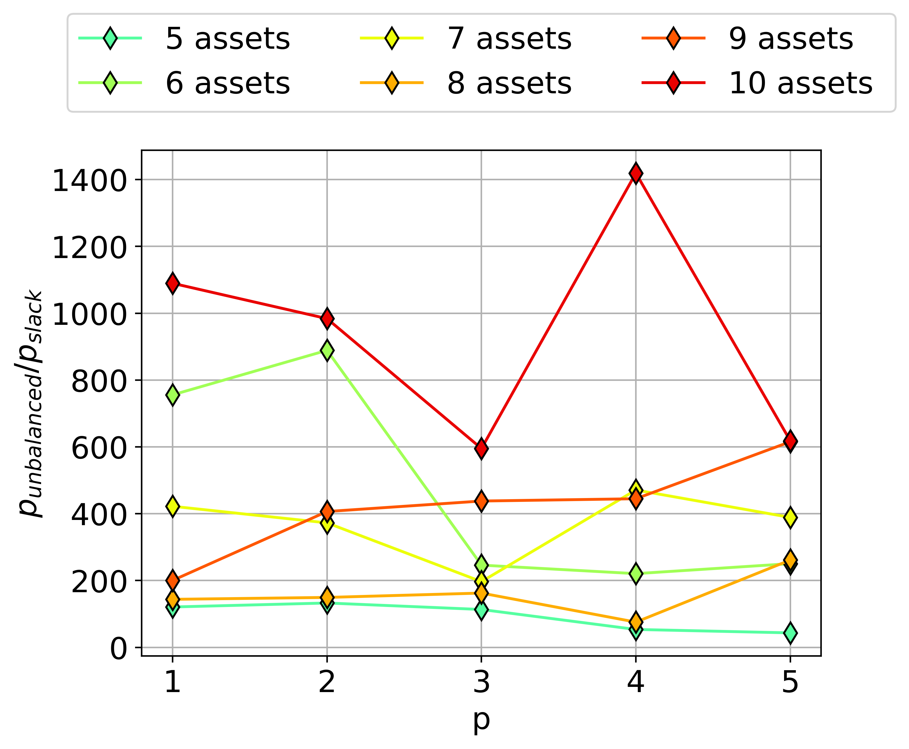
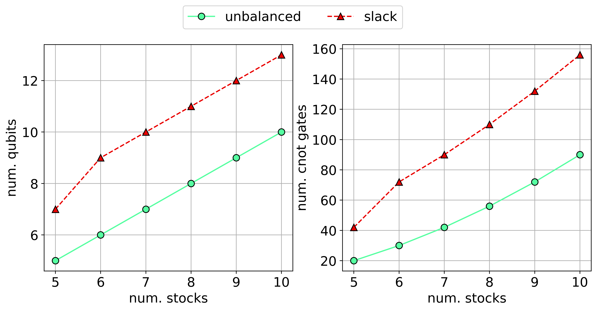
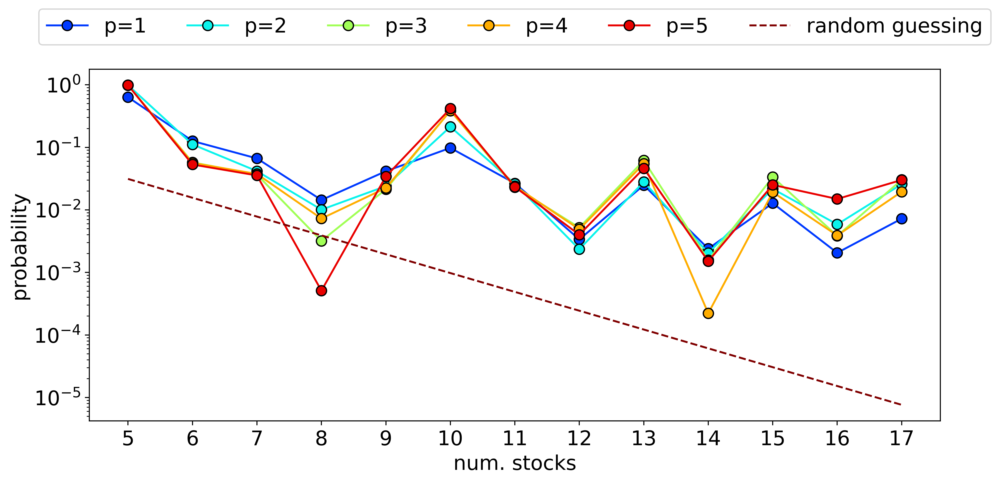
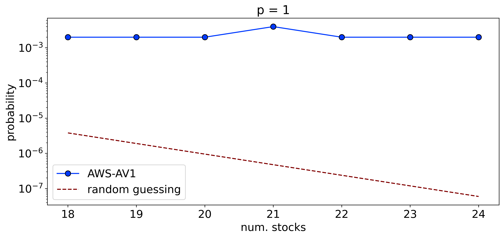
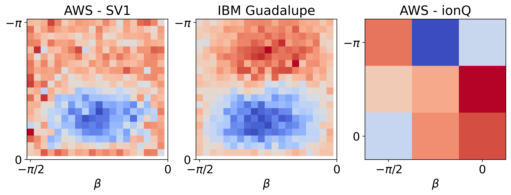
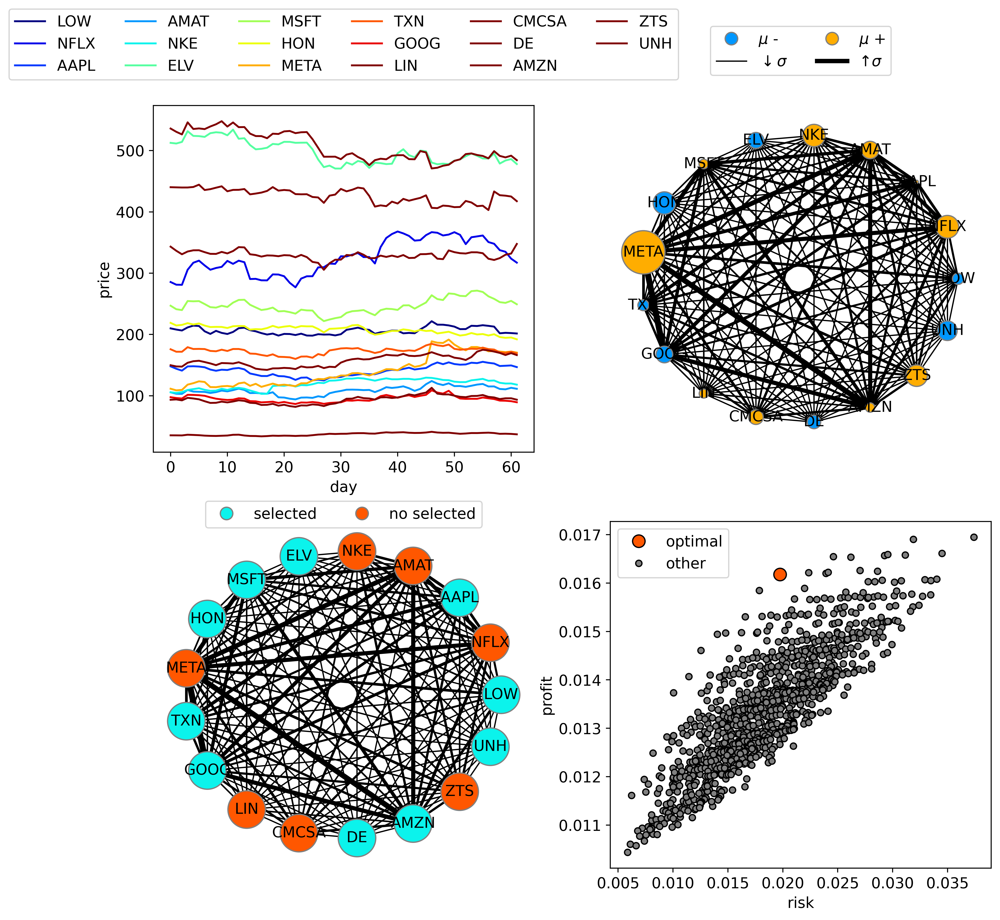

# Enhancing portfolio optimization solutions
## Wisely encoding constrained combinatorial optimization problems on quantum devices
# Objective

1. Benchmarking unbalanced penalization using portfolio optimization (file: 1_portfolio_optimization_mdls_comparison.ipynb)
2. Presenting an application of portfolio optimization using real stocks from S&P500 and test on real devices. (file: 2_portfolio_optimization_for_SP500.ipynb)
3. Making a tool for portfolio optimization visualization (file: 3_portfolio_optimization_visualization.ipynb)

# 1. Portfolio optimization: Comparing unbalanced penalization vs. Quantum Zeno Dynamics

Portfolio optimization problems usually come with a set of constraints, for example, in [[1]](https://arxiv.org/pdf/2209.15024.pdf) two inequality constraints are applied to ensure the investment in the assets is below the budget and to guarantee a minimum profit (see Sec. IV A of [[1]](https://arxiv.org/pdf/2209.15024.pdf)). Usually, to encode these inequality constraints in quantum computers we require extra qubits (for the slack variables). This has two disadvantages, first the probability of finding optimal solutions decrease and second the number of qubits and the depth of the circuits increases. To solve this problem, I use unbalanced penalization [[2]](https://arxiv.org/pdf/2211.13914.pdf), a new encoding method that does not require those extra qubits for the inequality constraints. This technique has been used in the traveling salesman problem, the bin packing problem, and the knapsack problem. I extended the solution to work with portfolio optimization. This method is expected to enhance the probability of finding optimal solutions, reducing the depth of the circuit and the number of qubits required. I solve the problem using QAOA, and VQE and compare it with the results from [1]. Additionally, results on real hardware are presented, and a visualization technique for the optimal solution and the circuit requirements.

In this section, it is used the unbalanced penalization method [[2]](https://arxiv.org/pdf/2211.13914.pdf) to encode different portfolio optimization problems subject to the following conditions 

* Cost function

$$\large{\min_{x \in \{0,1\}^{n}} q  x^T\Sigma x - \mu^T x}.$$

* Budget constraint:

$$\sum_j^n x_j \le C.$$

* Minimum return constraint

$$\sum_j^n \mu_j x_j \ge R.$$

where $x$ is a vector with elements $x_i=1$ if stock i is choosen and 0 otherwise, $n$ is the number of assets, $q$ is the risk factor, $\Sigma$ is covariance matrix, $\mu$ is the expected return, $C$ is the budget, and $R$ is the minimum return. 

The unbalanced penalization method takes inequality constraints of the form 

$$h(\mathrm{x}) =  \sum_i l_i x_i - B \ge 0$$

and translate them into

$$\zeta(x) = - \lambda_1 h(x) + \lambda_2 h(x)^2  = - \lambda_1\left(\sum_i l_i x_i - B\right) + \lambda_2 \left(\sum_i l_i x_i - B\right)^2 ,$$

where $\lambda_{1,2}$ are penalization terms that must be tuned for the specific problem (Details of the derivation of the unbalanced penalization method can be found in Sec. III of [[2]](https://arxiv.org/pdf/2211.13914.pdf)). For the portfolio optimization, the QUBO is given by

$$\min_{x \in \{0,1\}^{n}} q  x^T\Sigma x - \mu^T x - \lambda_1\left(C - \sum_j^n x_j\right) + \lambda_2\left(C - \sum_j^n x_j\right) - \lambda_1\left(\sum_j^n \mu_j x_j - R\right) + \lambda_2\left(\sum_j^n \mu_j x_j - R\right),$$

This solution gets rid of the slack variables usually used for inequality constraints of QUBOs. It has the advantage of reducing the number of qubits and gates needed and it shows a huge improvement in getting the optimal solution as it is shown in Sec. IV of [[2]](https://arxiv.org/pdf/2211.13914.pdf).

### 1.1 results: the models comparison

In the figure presented below, it is shown the results of the unbalanced penalization and the results obtained in [[1]](https://arxiv.org/pdf/2209.15024.pdf)(Fig. 2 in that paper) for three different cases. (left) In this case, it shown cases from 5 up to 10 stocks for the portfolio optimization with the budget constraint. The solutions present the approximation ratio vs. the number of QAOA layers. The stars represent the unbalanced penalization method, the dotted X QAOA with X mixer, and the dashed X the Quantum Zeno dynamics with X mixer. (center) same problem but for + mixer. (right) In this case the portfolio optimization includes both constraints, budget constraint and minimum return. Note that in all the cases, the unbalanced penalization method outperform the other methods with approximation rations above 0.9 even with one QAOA layer.

 

 

[1] Montanez-Barrera, A., Willsch, D., A., Maldonado-Romo, & Michielsen, K. (2022). Unbalanced penalization: A new approach to encode inequality constraints of combinatorial problems for quantum optimization algorithms. 23–25. http://arxiv.org/abs/2211.13914

[2] Herman, D., Shaydulin, R., Sun, Y., Chakrabarti, S., Hu, S., Minssen, P., Rattew, A., Yalovetzky, R., & Pistoia, M. (2022). Portfolio Optimization via Quantum Zeno Dynamics on a Quantum Processor. http://arxiv.org/abs/2209.15024

# 2. Portfolio optimization for S&P500 stocks

In this section, it's presented the solution of portfolio optimization using real data of the [S&P500](https://en.wikipedia.org/wiki/S%26P_500) stock market index. I use the python based library [yfinance](https://pypi.org/project/yfinance/) to get updated stock prices during the last three months. The solution is presented for the portfolio optimization with budget inequality constraint $\sum_{i=1}^n x_i \le C$ for the unbalanced penalization and slack encodings using QAOA and VQE. The stocks are taking randomly for a small dataset with 36 different stocks.

## 2.1 Results

### 2.1.1 Slack variables vs. unbalanced penalization: QAOA comparison

In the figure presented below, it is shown the results of the unbalanced penalization vs. slack variables encoding for the probability of finding the optimal solution in the portafolio optimization cases using QAOA with 1 to 5 layers. The optimal solution in this case is taking as solution found using [docplex](https://pypi.org/project/docplex/).  Fig. 1 (left) shows the unbalance penalization vs. the slack variables approach, the performance of the unbalanced penalization is two orders of magnitude greater than that of the slack variables approach. In Fig. 1 (right) it is only shown the performance of the unbalanced penalization approach, for all the cases the results of the unbalanced penalization approach are above 0.1 what means that in 100 shots on a real device, I can fing the optimal solution on average more than 10 times. 

<figure>

<figcaption align = "center"> Fig.1 Portfolio optimization probability of finding the optimal solution of  (left) Unbalanced penalization vs. slack variables, (right) Unbalanced penalization. </figcaption>
</figure>

To have another perspective of the improvement in performance, Fig. 2 shows the ratio between the probability of finding the optimal solution using the unbalanced penalization encoding over the probability using the slack variables approach. The best case is for 10 Stocks with an improvement of more than 1400 times in the probability of finding the optimal solution.

<figure>
 

 
<figcaption align = "center"> Fig.2 Portfolio optimization probability ratio of finding the optimal solution using unbalanced penalization over slack variables approach on QAOA with different p values. </figcaption>
</figure>
    
Additionally, we show the resource requirements of the unbalanced penalization method and the slack variables approach for QAOA with 1 layer. Fig. 3 (left) presents the number of qubits needed for each case (right) presents the number of cnot gates required for a fully connected device. Note that the number of qubits will increase considerably for real devices with no full connectivity because of the swap operations needed to move qubits around. Again, the unbalanced penalization method is a good option from the point of view of saving resources.
    
<figure>
 

 
<figcaption align = "center"> Fig.3 Resource requirements for portfolio optimization with 1 layer QAOA using the slack and unbalanced approaches. (left) the number of qubits needed (right) the number of CNOT gates for a fully connected device </figcaption>
</figure>

### 2.1.2 Generalization to larger stocks

To test the generalization capabilities of the unbalanced penalization method. I use a local simulator for up to 17 qubits and the AWS SV1 simulator to run from 18 to 24 stocks. Fig. 4 shows the results for the unbalanced penalization using QAOA and different number of layers p from 1 up to 5. The method as it was shown in [1](https://arxiv.org/pdf/2211.13914.pdf) has good generalization capabilities because it was training with only two cases 6 and 8 stocks.

<figure>
 

 
<figcaption align = "center"> Fig.4 Scaling the unbalanced penalization method for the portfolio optimization using QAOA with 1 up to 5 layers. </figcaption>
</figure>

After 17 qubits it takes a while to get the results on the local computer. Therefore, after this point, I used AWS SV1 to run tasks from 18 to 24 qubits. Fig. 5 shows the results in this case. I reduced the number of maximum iterations of the classical solver from 1000 to 500 and the number of shots to 500. Interestingly, at this point and with a restringed number of shots, I was able to find the optimal solutions. 

<figure>
 

 
<figcaption align = "center"> Fig.5 Scaling the unbalanced penalization method for the portfolio optimization using QAOA with 1 up to 5 layers. The results are from 18 to 24 stocks using AWS-SV1 with 500 shots and maximum classical solver iterations 500 </figcaption>
</figure>

### 2.1.3 Testing on real devices

To test if in real devices, I'm still able to obtain similar energy expectation value landscapes compare to the ideal case, I tested AWS-SV1 (ideal) vs. ibm_guadalupe (real) for 5 stocks using QAOA with 1 layer (My idea was to test also ionQ device but it takes 20 minutes to get one solution and the total cases I run were 400 for each device but I could execute at least 9 cases on this device). I have to admit that I was expecting more noise on the real device but the energy landscapes shown in Fig.6 look really similar for both devices. Finally, I show results for the ionQ device for 10 shots and 9 different points in the landscape because the queue time was on average 20 minutes, no real comparison of ionQ can be taken at this point.

<figure>
 

 
<figcaption align = "center"> Fig.6 Comparison between AWS-SV1, ibm_guadalupe, and ionQ using the unbalanced penalization encoding for 5 stocks and QAOA with 1 layer. For AWS-SV1 and ibm_guadalupe the grid is 20x20 and for ionQ 3x3.</figcaption>
</figure>

# 3. Visualization of the portfolio optimization

One of the main problems in general with combinatorial optmization problems after been solved by quantum computing algorithms is the visualization stage. For example in the portfolio optimization, after getting a string with zeros and ones, there is one step left and it is know if the solution looks right how it compares with other solutions and so on. 

In this section, I try to answer this question with a visualization tool called 'portfolio_optimization_visualization', a graph representation of portfolio optimization. Fig. 1 shows the results of the visualization of one problem with 17 stocks from the S&P 500. In this Fig. the up-left plot shows the different 17 stocks' prices in the last 2 months, Fig. 1 up-right shows the encoding of the portfolio optimization for this specific case, and the marker size for each stock represents the expected return with a blue value as a negative expected return and orange otherwise. The linewidth of the edges encodes the covariance between both stocks it connects. Fig. 1 down-left represents the optimal solution of the problem with red stocks that are chosen and finally, Fig.1 down-right represents the profit vs. risk for different stock configurations with a red mark on the optimal solution. 

<figure>

<figcaption align = "center"> Fig.1  Visualization of the portfolio optimization problem for 17 stocks (up-left) The stocks prices vs. time obtained from real data of S & P 500 (up-right) The problem encoding marker size represent the proportion of the stock expected return, the width of the edges represent the correlation between different stocks (down-left) Optimal solution configuration, the red colors mean the stocks chosen (down-right) profit vs. risk for the optimal solution in red and other possible solutions in grey.</figcaption>
</figure>

# Conclusions

In this project I showed how we can encode combinatorial optimization problems with inequalities constraints using the unbalanced penalization, a tool I designed to remove slack variables. I use this tool on the portfolio optimization problem with two different inequality constraints, one for the maximum budget and another for the minimum expected return. I compare specific models from "Portfolio Optimization via Quantum Zeno Dynamics on a Quantum Processor" and show that the unbalanced penalization shows better results even for a low number of layers. In the second part of the project, I run large cases of portfolio optimization showing that it can generalize. Additionally, in this section, I show the energy landscape for real devices on ibm_guadalupe and ionQ. Finally, I presented a tool to visualize portfolio optimization encoding and visualization.
